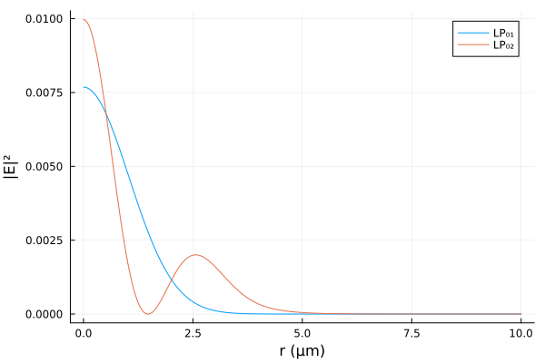

# OpticalFibers.jl

[](https://ovanvincq.github.io/OpticalFibers.jl) [](https://zenodo.org/badge/latestdoi/696327811)

OpticalFibers is a package that allows to compute modes of optical fibers. Different methods are implemented to find scalar or vector modes:
- A semi-analytical solver (based on Bessel functions) for multi-step index fibers.
- Finite element method (using `Gridap.jl`) for any kind of isotropic or anisotropic fiber. A PML (Perfectly Matched Layer) is implemented to compute losses of leaky modes guided in trench-assisted fibers, PCF (Photonic Crystal Fibers), bent fiber, twisted fiber, etc. The FEM mode solver can also be used to find photonic bandgaps of a PCF cladding.

In order to specify units of physical quantities, this package uses `Unitful.jl`.

## Installation
OpticalFibers requires at least julia 1.10 and can be installed with:

```julia
using Pkg
Pkg.add("OpticalFibers")
```

## Quickstart
### Finding guided modes of a step-index fiber using the semi-analytical mode solver
Computation of the scalar fundamental mode LP$_{01}$ of a step index fiber with a core-radius of 2 µm, a refractive index of 1.47 for core and 1.45 for cladding at a wavelength of 1 µm:
```julia
julia> using OpticalFibers, OpticalFibers.ModeSolvers
julia> ms=multi_step_fiber_modes(1u"µm",0,2u"µm",[1.47,1.45],field=true)
1-element Vector{Mode{ScalarFiberEMField1D}}:
 [LP 0,1 - neff = 1.463179347605715 - λ = 1 μm , EMField = ScalarFiberEMField1D]
julia> using Plots
julia> r=(0:0.1:7)u"µm"
julia> plot(r,abs.(ms[1].EMField.E.(r)),xlabel="r",ylabel="|E|",label="Fundamental Mode")
```


Computation of the fundamental vector mode HE$_{11}$ of the same fiber:
```julia
julia> mv=multi_step_fiber_modes(1u"µm",1,2u"µm",[1.47,1.45],type=:Vector)
1-element Vector{Mode}:
 [HE 1,1,1.4631371608572663,1,Nothing]
```

### Finding guided modes of a graded-index fiber using the FEM mode solver
Computation of the scalar modes of a parabolic-index fiber with a core-radius of 4 µm, a refractive index of 1.48 for core center and 1.45 for cladding at a wavelength of 1 µm by using the finite element method with 1000 nodes between r=0 and r=20 µm:
```julia
julia> using OpticalFibers, OpticalFibers.ModeSolvers
julia> m=FEM1D(1u"µm",0,x->1.45+0.03*(1-x[1]^2/16u"µm^2")*(x[1]<=4u"µm"),CartesianDiscreteModel((0,20),1000)*u"µm",field=true,neigs=5)
2-element Vector{Mode{ScalarFiberEMField1D}}:
 [Mode LP n°1 - neff = 1.4719806569716722 - λ = 1 μm , EMField = ScalarFiberEMField1D]
 [Mode LP n°2 - neff = 1.4561502566055362 - λ = 1 μm , EMField = ScalarFiberEMField1D]

julia> using Plots
julia> r=(0:0.01:10)u"µm"
julia> plot(r,abs2.(m[1].EMField.E(r)),label="LP₀₁",xlabel="r",ylabel="|E|²")
julia> plot!(r,abs2.(m[2].EMField.E(r)),label="LP₀₂",xlabel="r",ylabel="|E|²")
```


### Finding leaky modes of a step-index fiber with a trench using the FEM mode solver with a PML
Let us consider a step-index fiber with a trench:
- Core: radius 4 µm and refractive index 1.44
- Trench: thickness 16 µm and refractive index 1.41
- Cladding: refractive index 1.43

Computation of the guided modes $\ell=0$ without the cladding:
```julia
julia> m=multi_step_fiber_modes(1.6u"µm",0,4u"µm",[1.44,1.41])
2-element Vector{Mode{Nothing}}:
 [LP 0,1 - neff = 1.4345691826486056 - λ = 1.6 μm , EMField = Nothing]
 [LP 0,2 - neff = 1.4137165538840926 - λ = 1.6 μm , EMField = Nothing]
```

Computation of the guided modes $\ell=0$ with the cladding:
```julia
julia> m2=multi_step_fiber_modes(1.6u"µm",0,[4,20]u"µm",[1.44,1.41,1.43])
1-element Vector{Mode{Nothing}}:
 [LP 0,1 - neff = 1.4345691826495002 - λ = 1.6 μm , EMField = Nothing]
```
We found only one mode because the LP₀₂ becomes leaky when adding the cladding.

To compute its losses, we can use the FEM solver with a PML:
```julia
julia> RIP_trench=x->1.44-0.03*(x[1]>=4u"µm")+0.02*(x[1]>20u"µm");
julia> model_trench = CartesianDiscreteModel((0,50),5000)*u"µm";
julia> ms1D_trench=FEM1D(1.6u"µm",0,RIP_trench,model_trench,field=true,dPML=5u"µm",approx_neff=m[2].neff)
1-element Vector{Mode{ScalarFiberEMField1D}}:
 [Mode LP n°1 - neff = 1.4137165449018512 + 1.0825770569064243e-8im - λ = 1.6 μm , EMField = ScalarFiberEMField1D]
julia> ms1D_trench[1].losses
[369.2606344137047 dB] km^-1
```
Losses of the LP₀₂ mode are 369 dB/km.

### Finding bend losses using the FEM mode solver with a PML
Let us consider the step_index fiber described below:
- Core: radius 3.5 µm, refractive index 1.4457
- Cladding: refractive index 1.4378

Computation of the fundamental mode at $\lambda=1.55$ µm:
```julia
julia> ms_straight=multi_step_fiber_modes(1.55u"µm",0,3.5u"µm",[1.4457,1.4378])
1-element Vector{Mode}:
 [LP 0,1 - neff = 1.4414392004035022 - λ = 1.55 μm , EMField = Nothing]
```

 To compute the fundamental mode when the fiber is bent, we need to use a 2D mesh generated with GMSH:
```julia
julia> model = GmshDiscreteModel("./models/example5.msh")
Info    : Reading './models/example5.msh'...
Info    : 10 entities
Info    : 14768 nodes
Info    : 29186 elements
Info    : Done reading './models/example5.msh'
UnstructuredDiscreteModel()
```
and to define the refractive index profile of the fiber bent with a radius of curvature of 10 mm:
```julia
julia> RIP2D=x->1.4457-(1.4457-1.4378)*(hypot(x[1],x[2])>=3.5u"µm");
julia> RIP2D_bent=x->RIP2D(x)*(1+x[1]/10u"mm");
julia> ms2D_bent=FEM2D(1.55u"µm",RIP2D_bent,model*u"µm",field=true,neigs=1,dPML=3u"µm",approx_neff=ms_straight[1].neff)
1-element Vector{Mode{ScalarFiberEMField2D}}:
 [Mode LP n°1 - neff = 1.4414582242320717 + 1.5096368959603828e-9im - λ = 1.55 μm , EMField = ScalarFiberEMField2D]
julia> ms2D_bent[1].losses
[53.15388087039599 dB] km^-1
```
In this case, the bend losses are 53 dB/km

## Using MUMPS or CUDSS with Mode Solvers
The computation of modes of large microstructured fibers can take a long time (several minutes). It is possible to reduce this computation time by using the package `MUMPS.jl` or `CUDSS.jl` to speed up the LU decomposition. Note that support of `CUDSS.jl` is experimental because the iterative refinement tolerance is not yet implemented in CUDSS and the number of iterative refinement step has been arbitrarily set to 10. Using CUDSS requires a GPU with sufficient memory (and with good FP64 performance).

On windows, recent versions of `MUMPS.jl` do not work and it is recommended to use version 1.4.0:
```julia
using Pkg
julia> Pkg.add(name="MUMPS",version="1.4.0")
julia> Pkg.pin("MUMPS")
```

The support of `CUDSS.jl` is restricted to version >=0.5.3
```julia
using Pkg
julia> Pkg.add(name="CUDSS",version="0.5.3")
julia> Pkg.pin("CUDSS")
```

To compute the modes, the keyword solver must be used:
```julia
julia> using MUMPS
julia> ms2D_bent=FEM2D(1.55u"µm",RIP2D_bent,model*u"µm",field=true,neigs=1,dPML=3u"µm",approx_neff=ms_straight[1].neff,solver=:MUMPS)
1-element Vector{Mode{ScalarFiberEMField2D}}:
 [Mode LP n°1 - neff = 1.4414582242320715 + 1.5096368959671403e-9im - λ = 1.55 μm , EMField = ScalarFiberEMField2D]
julia> using CUDSS
julia> ms2D_bent=FEM2D(1.55u"µm",RIP2D_bent,model*u"µm",field=true,neigs=1,dPML=3u"µm",approx_neff=ms_straight[1].neff,solver=:CUDSS)
1-element Vector{Mode{ScalarFiberEMField2D}}:
 [Mode LP n°1 - neff = 1.4414582242320717 + 1.5096369002222508e-9im - λ = 1.55 μm , EMField = ScalarFiberEMField2D]
```


## Credits
OpticalFibers.jl is maintained by Olivier Vanvincq ([University of Lille](https://www.univ-lille.fr/), [PhLAM laboratory](https://phlam.univ-lille.fr/)).