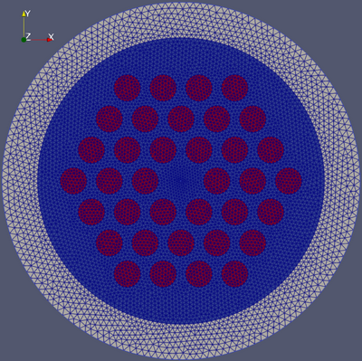

# OpticalFibers.ModeSolvers - Tutorial

```@meta
CurrentModule = OpticalFibers.ModeSolvers
```

## Bimodal Step-index Fiber
This section explains how to modelize a step-index fiber with a core radius $a=2$ µm. The refractive index of the core is $n_{\text{core}}=1.47$ and that of the cladding is $n_{\text{cladding}}=1.45$. 

This fiber is bimodal at $\lambda=1$ µm since the normalized frequency is $V=\frac{2\pi a}{\lambda}\sqrt{n_{\text{core}}^2-n_{\text{cladding}}^2}=3.04$. 

### Scalar Modes
To compute the two scalar modes, we can use the fuction `multi_step_fiber_modes` that returns a vector of modes. The arguments are the wavelength, the azimuthal number, the radius of the core and a vector describing the refractive index. The optional argument `field` indicates that we want to return modes that contain a field.

```@example 1
#using Pkg; nothing # hide
#Pkg.activate("../.."); nothing # hide
using OpticalFibers # hide
using OpticalFibers.ModeSolvers # hide
m0=multi_step_fiber_modes(1,0,2,[1.47,1.45],field=true);
m01=m0[1]
m1=multi_step_fiber_modes(1,1,2,[1.47,1.45],field=true);
m11=m1[1]
nothing; #hide
```

Note that you can also use broadcasting to compute all modes with a single command. The function `Ref` allows to use the same vector of refractive index for all values of the azimuthal number. 
```@example 1
m=multi_step_fiber_modes.(1,[0,1],2,Ref([1.47,1.45]),field=true);
m01=m[1][1];
m11=m[2][1];
nothing; #hide
```

The mode profile can be easily plotted by using the function `computeField`
```@example 1
using Plots
r=0:0.01:10;
plot(r,computeField(m01,r),label=m01.Name)
plot!(r,computeField(m11,r),label=m11.Name)
```

In order to visualize the modes in a 2D plot, we can convert the `Mode{ScalarFieldFunction1D}` to a `Mode{ScalarFieldFunction2D}` but we have to indicate the orientation of the mode by using the `cos` function or the `sin` function. Then, we normalize the modes and plot one of the two LP$_{11}$ modes. Be careful when using `Plots.jl`: unlike this package, the second index of the matrix corresponds to the x-coordinate (as matlab but the opposite of `Makie.jl`).
```@example 1
mm01=convertTo2D(m01)
mm11c=convertTo2D(m11)
mm11s=convertTo2D(m11,90)
normalize!(mm01)
normalize!(mm11c)
normalize!(mm11s)
x=-8:0.125:8;
contourf(x,x,computeField(mm11c,x,x')',levels=100,linewidth=0)
```

The beating between the LP$_{01}$ and the LP$_{11}$ can be observed by plotting the sum of the fields for different values of the distance $z$. The beating length is $\frac{2\pi}{\vert \Delta \beta \vert} = \frac{\lambda}{\vert \Delta n_{eff} \vert}\simeq 107$ µm
```@example 1
L=1/(m01.neff-m11.neff)
```

We can take advantage of the possibility to add fields to create the animation.
```@example 1
anim=@animate for j=0:214
    TotalField=getField(mm01,j)+getField(mm11c,j);
    contourf(x,x,abs2.(computeField(TotalField,x,x'))',levels=100,linewidth=0,title="z = $j µm")
end;
gif(anim,"anim_field.gif",fps=15)
```

### Vector modes
It is also possible to compute the vector modes of the fiber: LP$_{01}$ mode becomes HE$_{11}$ mode and LP$_{11}$ mode becomes TE$_{01}$, TM$_{01}$ and HE$_{21}$ modes. To compute these modes, we just have to set the argument `type` to `:Vector` (its default value is `:Scalar`).

```@example 1
mv0=multi_step_fiber_modes(1,0,2,[1.47,1.45],field=true,type=:Vector)
```

```@example 1
mv1=multi_step_fiber_modes(1,1,2,[1.47,1.45],field=true,type=:Vector)
```

```@example 1
mv2=multi_step_fiber_modes(1,2,2,[1.47,1.45],field=true,type=:Vector)
```

Then, the Poynting vector of the mode HE$_{21}$ can be computed and plotted. Since the field is described by functions, the Poynting vector components are also functions of the tuple (x,y).
```@example 1
Px,Py,Pz=PoyntingVector(mv2[1]);
contourf(x,x,Pz.(tuple.(x,x'))',linewidth=0,levels=100,xlims=(-4,4),ylims=(-4,4))
X,Y=meshgrid(x[1:4:end]);
quiver!(X,Y,quiver=(computeField(mv2[1],x[1:4:end],x[1:4:end]',:Ex)'/20,computeField(mv2[1],x[1:4:end],x[1:4:end]',:Ey)'/20),color=:cyan,arrow=arrow(:closed))
```

In order to check the orthoganality of the modes, we can normalize them and compute the overlap integrals. Note that in the case of functions, there are two optionnal arguments for the function `overlap`: `rtol` (relative tolerance) and `atol` (absolute tolerance). These tolerances are used to compute the integrals with the package `HCubature`. Here, we know that the integrals are very small in the case of two orthogonal modes so that the relative tolerance on the overlap integral cannot be reached because of Bessel function precision. This is why we have imposed an absolute tolerance of 1E-15.
```@example 1
mv=[mv1;mv0;mv2];
normalize!.(mv,atol=1E-5);
overlap.(mv,transpose(mv),atol=1E-15,rtol=1E-5)
```

### Scalar modes with FEM1D
We can find the results above using the FEM method. We will start with the 1D method since the fiber has a cylindrical symmetry. The mesh must begin at $r=0$ and we have set its end at 15 µm. The number of elements is set to 1500. The FEM computation functions require the relative permittivity i.e. the square of the refractive index. We indicate to the the FEM solver that we want to compute 4 eigenvalues but it returns only one since there is only one mode for $\ell=0$.
```@example 1
using Gridap
model = CartesianDiscreteModel((0,15),1500)
epsilon=x->(1.47-0.02*(x[1]>=2))^2
m0FEM=FEM1D(1,0,epsilon,model,field=true,neigs=4)
normalize!(m0FEM[1])
normalize!(m0[1])
r=0:0.01:10
plot(r,computeField(m0[1],r),label="Step-index solver")
plot!(r,-real(computeField(m0FEM[1],r)),label="FEM1D solver",line=:dash)
```

### Scalar modes with FEM2D
We can also use the FEM2D method. For this, we use a mesh created with GMSH and a function of the tuple $(x,y)$ that describes the permittivity. We ask the solver to find 4 modes but it returns only 3 because the fiber can only guides the modes LP01, LP11a and LP11b (a and b refer to the orientation of the mode).
```@example 1
using GridapGmsh
model = GmshDiscreteModel("../../models/example1.msh");
epsilon2D=x->(1.47-0.02*(hypot(x[1],x[2])>=2))^2
mFEM2D=FEM2D(1,epsilon2D,model,field=true,neigs=4)
normalize!.(mFEM2D)
p1=contourf(x,x,real(computeField(mFEM2D[1],x,x'))',levels=50,linewidth=0,aspect_ratio=:equal);
p2=contourf(x,x,real(computeField(mFEM2D[2],x,x'))',levels=50,linewidth=0,aspect_ratio=:equal);
p3=contourf(x,x,real(computeField(mFEM2D[3],x,x'))',levels=50,linewidth=0,aspect_ratio=:equal);
plot(p1, p2, p3, layout=(1,3), legend=false,size=(900,300))
```
```@example 1
abs2.(overlap.(mFEM2D,[mm01 mm11c mm11s]))
```

### Vector modes with FEM2D
To compute the vector, we just have to set `type` to `:Vector`. We ask the solver to find 8 modes but it returns only 6 because the fiber can only guides 2 modes HE$_{11}$, 1 mode becomes TE$_{01}$, 1 mode TM$_{01}$ and 2 modes HE$_{21}$. 
```@example 1
mvFEM2D=FEM2D(1,epsilon2D,model,field=true,neigs=8,type=:Vector)
normalize!.(mvFEM2D)
abs2.(overlap.(mvFEM2D,transpose(mv)))
```
In addition to the computation of the overlaps, we can verify that the modes given by the quasi-analytical solver and the FEM solver are the same by plotting the fields.
```@example 1
p1=contourf(x,x,real(computeField(mvFEM2D[4],x,x',:Ex))',levels=50,linewidth=0,aspect_ratio=:equal,title="Ex");
p2=contourf(x,x,real(computeField(mvFEM2D[4],x,x',:Ey))',levels=50,linewidth=0,aspect_ratio=:equal,title="Ey");
p3=contourf(x,x,imag(computeField(mvFEM2D[4],x,x',:Ez))',levels=50,linewidth=0,aspect_ratio=:equal,title="Ez");
p4=contourf(x,x,real(computeField(mvFEM2D[4],x,x',:Hx))',levels=50,linewidth=0,aspect_ratio=:equal,title="Hx");
p5=contourf(x,x,real(computeField(mvFEM2D[4],x,x',:Hy))',levels=50,linewidth=0,aspect_ratio=:equal,title="Hy");
p6=contourf(x,x,imag(computeField(mvFEM2D[4],x,x',:Hz))',levels=50,linewidth=0,aspect_ratio=:equal,title="Hz");
plot(p1, p2, p3, p4, p5, p6, layout=(2,3), legend=false,size=(900,600))
```
```@example 1
p1=contourf(x,x,real(computeField(mv[4],x,x',:Ex))',levels=50,linewidth=0,aspect_ratio=:equal,title="Ex");
p2=contourf(x,x,real(computeField(mv[4],x,x',:Ey))',levels=50,linewidth=0,aspect_ratio=:equal,title="Ey");
p3=contourf(x,x,imag(computeField(mv[4],x,x',:Ez))',levels=50,linewidth=0,aspect_ratio=:equal,title="Ez");
p4=contourf(x,x,real(computeField(mv[4],x,x',:Hx))',levels=50,linewidth=0,aspect_ratio=:equal,title="Hx");
p5=contourf(x,x,real(computeField(mv[4],x,x',:Hy))',levels=50,linewidth=0,aspect_ratio=:equal,title="Hy");
p6=contourf(x,x,imag(computeField(mv[4],x,x',:Hz))',levels=50,linewidth=0,aspect_ratio=:equal,title="Hz");
plot(p1, p2, p3, p4, p5, p6, layout=(2,3), legend=false,size=(900,600))
```

## Gradient index fiber and dispersion
In this tutorial, a germanium-doped parabolic gradient index fiber will be studied. The maximum Ge concentration is 20% and the core radius is 3.5 µm. The silica dispersion will be taken into account.

First, a vector of `Function` is created to modelized the dispersive refractive index profile between 1 and 1.5 µm:
```@example 2
using OpticalFibers
using OpticalFibers.PhysicalData
using Plots
lambda=1:0.01:1.5;
epsilon=[x->(n_Ge_Doped_Silica(l*1e-6,0)+(n_Ge_Doped_Silica(l*1e-6,0.2)-n_Ge_Doped_Silica(l*1e-6,0))*(x[1]<=3.5)*(1-x[1]^2/3.5^2))^2 for l in lambda];
r=0:0.1:5;
plot(r,sqrt.(epsilon[1].(r)),label="λ = 1 µm",xlabel="r (µm)",ylabel="Refractive index");
plot!(r,sqrt.(epsilon[end].(r)),label="λ = 1.5 µm")
```

The modal content is then computed (note that we must use Ref(model) because length(model) is not defined in Gridap):
```@example 2
using OpticalFibers.ModeSolvers
using Gridap
model = CartesianDiscreteModel((0,20),2000)
m=FEM1D.(lambda,[0,1,2]',epsilon,Ref(model),neigs=2);
#mode LP01 always exists
neff01=[real(m[j,1][1].neff) for j in 1:length(lambda)];
N02=sum((length.(m[:,1])).>=2);
neff02=[real(m[j,1][2].neff) for j in 1:N02];
N11=sum((length.(m[:,2])).>=1);
neff11=[real(m[j,2][1].neff) for j in 1:N11];
N21=sum((length.(m[:,3])).>=1);
neff21=[real(m[j,3][1].neff) for j in 1:N21];
plot(lambda,n_Ge_Doped_Silica.(lambda*1E-6,0),label="Silica",xlabel="λ (µm)",ylabel="Effective index",color=:black);
plot!(lambda,n_Ge_Doped_Silica.(lambda*1E-6,0.2),label="Ge-doped Silica (20%)",color=:black,line=:dash);
plot!([lambda,lambda[1:N11],lambda[1:N02],lambda[1:N21]],[neff01,neff11,neff02,neff21],label=["LP01" "LP11" "LP02" "LP21"])
```

The second-order dispersion is defined by $\beta_2=\frac{\partial^2 \beta}{\partial \omega^2}$.
```@example 2
beta01=neff01*2*pi./lambda*1E6;
omega=2*pi*OpticalFibers.PhysicalData.c./lambda*1E6;
omega2,beta2=derivative((omega,beta01),2);
lambda2=2*pi*OpticalFibers.PhysicalData.c./omega2*1E6;
plot(lambda2,beta2*1E26,xlabel="λ (µm)",ylabel="β₂ (10⁻²⁶ s²/m)",label="LP01")
```

To compute the effective area and the non-linear coefficient of the fundamental mode, the fields must be calculated:
```@example 2
m=FEM1D.(lambda,0,epsilon,Ref(model),field=true);
m=[m[i][1] for i in 1:length(lambda)];
A=Aeff.(m);
gamma=nonLinearCoefficient.(m,2.53E-20)*1E21;
plot(lambda,A,label="Aeff",ylabel="Effective area (µm²)",xlabel="λ (µm)",color=:blue,leg=:topright);
plot!(twinx(),lambda,gamma,label="γ",ylabel="Non-linear coefficient ((W.km)⁻¹)",color=:red,leg=:topleft)
```

## Leaky modes in step index fiber with a low index trench

### Circular core
In this example, we study a fiber with the parameters below:
- core with a radius of 4 µm and a refractive index of 1.46
- a trench located between 4 µm and 7 µm with a refractive index of 1.41
- a cladding with a refractive index of 1.45

In order to compute the leaky scalar modes at $\lambda=1.6$ µm, a PML must be added when using a FEM solver. In this example, the PML is located between 12 µm and 15 µm (thickness of 3 µm).
```@example 5
using OpticalFibers
using OpticalFibers.ModeSolvers
using Gridap
epsilon=x->(1.46-0.05*(x[1]>=4)+0.04*(x[1]>7))^2;
model = CartesianDiscreteModel((0,15),1500)
m0=FEM1D(1.6,0,epsilon,model,field=true,dPML=3,neigs=10)
```
The LP$_{01}$ mode is the mode 1. Since its effective index is greater than the refractive index of the cladding, this mode is guided and its losses are not significant.

The LP$_{02}$ mode is the mode 5, its losses in dB/km can be calculated:
```@example 5
losses(m0[5])*1e6
```

```@example 5
using Plots
r=0:0.01:15
normalize!.(m0)
plot(r,real.(computeField(m0[1],r)),xlabel="r (µm)",ylabel="real(E)",label="LP01")
plot!(r,-real.(computeField(m0[5],r)),label="LP02")
```

We can also compute the effective index of the LP$_{11}$ mode:
```@example 5
m1=FEM1D(1.6,1,epsilon,model,field=true,dPML=3,neigs=15);
pos=argmin(losses.(m1)*1E6);
m1[pos].neff
```

To compute the leaky vector modes that correspond to the LP$_{11}$ mode, we can also add a PML to the FEM2D solver:
```@example 5
using Gridap
using GridapGmsh
model = GmshDiscreteModel("../../models/Step_index_fiber_pml.msh");
epsilon2D=x->epsilon(hypot(x[1],x[2]));
m=FEM2D(1.6,epsilon2D,model,field=true,neigs=4,approx_neff=real(m1[pos].neff),dPML=3,type=:Vector)
```

The field can be plotted using GridapMakie:
```@example 5
using GridapMakie
using GLMakie
fig,ax,plot_obj=GLMakie.plot(get_triangulation(m[1]),real(m[1].field.Ex),axis=(aspect=DataAspect(),),colormap=:jet)
Colorbar(fig[1,2], plot_obj);
save("FEM_PML_Ex.png",fig); nothing #hide
```


### Elliptical core 
In this example, the fiber is similar to the previous one but the core and the trench are elliptic:
- core with a radius of 4 µm in the x direction and 2 µm in the y direction and a refractive index of 1.46
- a trench with a refractive index of 1.41 and located between the core and an ellipse with radii 8 and 4 µm in x and y direction respectively
- a cladding with a refractive index of 1.45


A rectangular PML is added for $12<\vert x \vert < 15$ µm and $8<\vert x \vert < 11$ µm to compute the leaky modes.

We can compute the modes in the scalar approximation or the vector modes. The results are similar since the refractive index steps are very low.

```@example 5
model2 = GmshDiscreteModel("../../models/Elliptic_fiber_rectangular_pml.msh");
epsilon2=x->(1.46-0.05*(x[1]^2/16+x[2]^2/4>=1)+0.04*(x[1]^2/64+x[2]^2/16>1))^2
m_scalar=FEM2D(1.6,epsilon2,model2,neigs=2,approx_neff=1.44,field=true,solver=:MUMPS,dPML=3)
```
```@example 5
m_vector=FEM2D(1.6,epsilon2,model2,neigs=4,approx_neff=1.44,field=true,solver=:MUMPS,dPML=3,type=:Vector)
```

The first mode can be saved in a file that can be opened with ParaView:
```@example 5
writevtk("mode1",m_vector[1]);
```


## Bent fiber
In this example, we will compute the bending losses of a step-index fiber at a wavelength of 1.55 µm. The core of the fiber has a refractive index of 1.4457 and a radius of 3.5 µm. The refractive index of the cladding is 1.4378.

First, we can use the step-index solver to calculate the effective index. Then, the approximate formula given in the Snyder & Love [SnyderLove:1983](@cite) (Formula 23-23, page 481) can be used to compute the attenuation coefficient $\gamma=2*Im(\beta)$:

```@example 6
using OpticalFibers
using OpticalFibers.ModeSolvers
using Bessels
lambda=1.55
ncore=1.4457
ncladding=1.4378
rho=3.5
delta=(ncore^2-ncladding^2)/(2*ncore^2)
V=2*pi*rho/lambda*sqrt(ncore^2-ncladding^2)
ms0=multi_step_fiber_modes(lambda,0,rho,[ncore,ncladding])
neff=ms0[1].neff
U=2*pi*rho/lambda*sqrt(ncore^2-neff^2)
W=2*pi*rho/lambda*sqrt(neff^2-ncladding^2)
gamma=x->sqrt(pi)/2/(rho*1E-6)*sqrt(rho*1E-6/x)*U^2/V^2/W^(1.5)/(besselk(1,W)^2)*exp(-4/3*x/(rho*1E-6)*W^3/V^2*delta)
neff
```
To compute losses with FEM in the scalar approximation and neglecting the elasto-optics effect, we must add a PML and multiply the refractive index by $(1+x/Rc)$ with $Rc$ the bending radius. Note that the cladding must be large enough to contain the turning point (point at which the refractive index equals the effective index): in the case studied here, the cladding outer radius must be at least 25 µm for a bent radius of 10 mm. Then, we construct a model with a PML located between 32 and 35 µm.

We first compute the effective index with the FEM2D function to check that we obtain the same value as with the step-index solver.
```@example 6
using GridapGmsh
model = GmshDiscreteModel("../../models/example5.msh");
epsilon2D=x->(ncore-(ncore-ncladding)*(hypot(x[1],x[2])>=rho))^2
mFEM2D=FEM2D(lambda,epsilon2D,model,field=true,neigs=1);
neff0=mFEM2D[1].neff
```

Then we calculate modes and the attenuation coefficent for Rc between 1 and 10 mm. Note that we use threads to accelerate the computation (this is not possible when using the MUMPS solver because it uses its own threads system and this causes an error).
```@example 6
RcFEM=1:1:10
gammaFEM=zeros(length(RcFEM))
mFEM=Vector{Mode}(undef,length(RcFEM))
Threads.@threads for i in axes(RcFEM,1)
    epsilon2D_bent=x->epsilon2D(x)*(1+x[1]/RcFEM[i]*1E-3)^2
    mFEM2D_bent=FEM2D(lambda,epsilon2D_bent,model,neigs=1,dPML=3,approx_neff=neff0,field=true);
    mFEM[i]=mFEM2D_bent[1]
    gammaFEM[i]=2*imag(2*pi*mFEM2D_bent[1].neff/(lambda*1E-6))
end
using Plots
Rc=1:0.01:10
plot(Rc,gamma.(Rc*1E-3),yaxis=:log,xlabel="Rc (mm)",ylabel="γ (m⁻¹)",label="Snyder & Love")
plot!(RcFEM,gammaFEM,label="FEM2D")
```
The value given by FEM 2D is slighlty different from that predicted by the analytical formula and the difference increases as the bent radius decreases because the mode increasingly distorted.
```@example 6
using GridapMakie
using GLMakie
using Gridap
fig=GLMakie.Figure(resolution=(750,250))
fig1,ax1=GLMakie.plot(fig[1,1],get_triangulation(mFEM[10]),abs(mFEM[10].field.E),axis=(aspect=DataAspect(),),colormap=:jet);
fig2,ax2=GLMakie.plot(fig[1,2],get_triangulation(mFEM[3]),abs(mFEM[3].field.E),axis=(aspect=DataAspect(),),colormap=:jet);
fig3,ax3=GLMakie.plot(fig[1,3],get_triangulation(mFEM[1]),abs(mFEM[1].field.E),axis=(aspect=DataAspect(),),colormap=:jet);
fig1.title="Rc = 10 mm"
fig2.title="Rc = 3 mm"
fig3.title="Rc = 1 mm"
save("Bent_fiber.png",fig); nothing #hide
```


In the case of vector modes, we can also multiply the refractive index by $(1+x/Rc)$ but, more rigourously, we have to multiply the permittivity and permeability tensors by $\left(\begin{matrix} (1+x/Rc) & 0 & 0\\
0 & (1+x/Rc) & 0 \\ 0 & 0 & (1+x/Rc)^{-1} \end{matrix}\right)$. Below, we compute the modes of the fiber with a bent radius of 3 mm.

```@example 6
R=3E3;
eps_anisotrope=tensor3(x->epsilon2D(x)*(1+x[1]/R),x->epsilon2D(x)*(1+x[1]/R),x->epsilon2D(x)/(1+x[1]/R))
mu_anisotrope=tensor3(x->(1+x[1]/R),x->(1+x[1]/R),x->1.0/(1+x[1]/R))
eps_anisotrope_pml=add_cylindrical_PML(eps_anisotrope,32,3,10)
mu_anisotrope_pml=add_cylindrical_PML(mu_anisotrope,32,3,10)
t=FEM2D_anisotropic(lambda,eps_anisotrope_pml,mu_anisotrope_pml,model,approx_neff=neff0,neigs=2,field=true,solver=:MUMPS)
```

## Twisted fiber
The method used to compute the modes of an isotropic fiber is described in a paper written by Nicolet et al. [Nicolet2007](@cite). In the following example, we use the same fiber as in the bent fiber example but instead of being bent, the fiber is twisted with a period of $P=2$ mm.
```@example 6
eps_twist=OpticalFibers.add_twist_PML(epsilon2D,2E3,32,3,10)
mu_twist=add_twist_PML(1,2E3,32,3,10)
t=FEM2D_anisotropic(lambda,eps_twist,mu_twist,model,approx_neff=neff0,neigs=20,field=true,solver=:MUMPS)
```
Modes 2 and 20 are the HE$_{11}$ modes. The losses are not significant since the twist has no effect on a circular centered core. However, the effective indices are no more degenerate: as explained by Napiorkowski et al. [Napiorkowski:2014](@cite), in the helicoidal coordinates system, the effective index is neff$\pm\frac{\nu \lambda}{P}$ with $\nu$ the azimuthal number ($\nu=1$ for the HE$_{11}$ mode).

If the core is shifted by 10 µm, losses due to the twist appear:
```@example 6
epsilon2D_shift=x->(ncore-(ncore-ncladding)*(hypot(x[1]-10,x[2])>=rho))^2
eps_shift_twist=OpticalFibers.add_twist_PML(epsilon2D_shift,2E3,32,3,10)
model_shift = GmshDiscreteModel("../../models/example5-decale.msh");
t=FEM2D_anisotropic(lambda,eps_shift_twist,mu_twist,model_shift,approx_neff=neff0,neigs=20,field=true,solver=:MUMPS)
```

## Photonic crystal fiber (PCF)
In a PCF, the modes are not guided modes but leaky modes so that the computation requires a PML. The fiber is constituted of three rings of air hole (n=1) inserted in silica (n=1.45). The pitch is 2 µm, the hole diameter is 1.5 µm and the PML begins at 8 µm from the fiber center and its thickness is 2 µm. 



First, the mesh is loaded:
```@example 4
using OpticalFibers
using OpticalFibers.ModeSolvers
using Gridap
using GridapGmsh
using GridapMakie
using GLMakie
model = GmshDiscreteModel("../../models/PCF.msh");
```
Then we define the permittivity function:
```@example 4
function eps_PCF(x)
    Pitch=2;
    r_hole=0.75;
    pos=ring.(1:3)
    xc=vcat(first.(pos)...)*Pitch;
    yc=vcat(last.(pos)...)*Pitch;
    for i in axes(xc,1)
        rc=hypot(x[1]-xc[i],x[2]-yc[i]);
        if rc<r_hole
            return 1.0;
        end
    end
    return 1.45^2;
end
```
Then we can compute four modes whose effective indices are close to the approximate value calculated for the fundamental mode at the wavelength of 1.3 µm:
```@example 4
neff_approx=approx_neff_PCF(1.3,1.5,2);
m=FEM2D(1.3,eps_PCF,model,neigs=4,approx_neff=neff_approx,field=true,solver=:MUMPS,type=:Vector,dPML=2)
```
The last two modes are fundamental modes. We can compute and plot the z-component of the Poynting vector of the last mode:
```@example 4
Px,Py,Pz=PoyntingVector(m[end]);
fig,ax,plot_obj=GLMakie.plot(get_triangulation(Pz),Pz,axis=(aspect=DataAspect(),),colormap=:jet)
ax.xlabel="x (µm)";
ax.ylabel="y (µm)";
ax.title="neff = $(m[end].neff)";
Colorbar(fig[1,2], plot_obj);
save("FEM2_Pz.png",fig); nothing #hide
```

