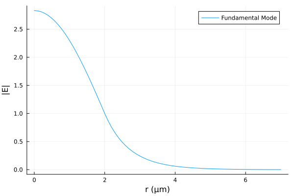

# OpticalFibers.jl

[](https://ovanvincq.github.io/OpticalFibers.jl) [](https://zenodo.org/badge/latestdoi/696327811)

OpticalFibers is a package that allows to compute modes of optical fibers. Different methods are implemented to find scalar or vector modes:
- A semi-analytical solver (based on Bessel functions) for multi-step index fibers.
- Finite element method (using `Gridap.jl`) for any kind of isotropic or anisotropic fiber. A PML (Perfectly Matched Layer) is implemented to compute losses of leaky modes guided in trench-assisted fibers, PCF (Photonic Crystal Fibers), bent fiber, twisted fiber, etc. The FEM mode solver can also be used to find photonic bandgaps of a PCF cladding.

## Installation
OpticalFibers requires at least julia 1.9 and can be installed with:

```julia
using Pkg
Pkg.add("OpticalFibers")
```

## Quickstart
### Finding guided modes of a step-index fiber using the semi-analytical mode solver
Computation of the scalar fundamental mode (l=0) of a step index fiber with a core-radius of 2 µm, a refractive index of 1.47 for core and 1.45 for cladding at a wavelength of 1 µm:
```julia
julia> using OpticalFibers
julia> using OpticalFibers.ModeSolvers
julia> ms=multi_step_fiber_modes(1,0,2,[1.47,1.45],field=true)
1-element Vector{Mode}:
 [LP 0,1,1.463179347605715,1,ScalarFieldFunction1D]
julia> using Plots
julia> plot(0:0.1:7,abs.(ms[1].field.E.(0:0.1:7)),xlabel="r (µm)",ylabel="|E|",label="Fundamental Mode")
```


Computation of the fundamental vector mode (l=1) of the same fiber:
```julia
julia> mv=multi_step_fiber_modes(1,1,2,[1.47,1.45],type=:Vector)
1-element Vector{Mode}:
 [HE 1,1,1.4631371608572663,1,Nothing]
```

### Finding guided modes of a graded-index fiber using the FEM mode solver
Computation of the scalar modes of a parabolic-index fiber with a core-radius of 4 µm, a refractive index of 1.48 for core center and 1.45 for cladding at a wavelength of 1 µm by using the finite element method with 1000 nodes between r=0 and r=20 µm:
```julia
julia> using OpticalFibers
julia> using OpticalFibers.ModeSolvers
julia> using Gridap
julia> m=FEM1D(1,0,x->(1.45+0.03*(1-x[1]^2/16)*(x[1]<=4))^2,CartesianDiscreteModel((0,20),1000),field=true,neigs=5)
2-element Vector{Mode{ScalarFieldFEM1D}}:
 [Mode LP n°1,1.471980656971672,1,ScalarFieldFEM1D]
 [Mode LP n°2,1.4561502566053002,1,ScalarFieldFEM1D]

julia> using Plots
julia> r=0:0.01:10
julia> plot(r,abs2.(computeField(m[1],r)),label="LP₀₁",xlabel="r (µm)",ylabel="|E|²")
julia> plot!(r,abs2.(computeField(m[2],r)),label="LP₀₂",xlabel="r (µm)",ylabel="|E|²")
```


### Finding leaky modes of a step-index fiber with a trench using the FEM mode solver with a PML
Let us consider a step-index fiber with a trench:
- Core: radius 4 µm and refractive index 1.44
- Trench: thickness 16 µm and refractive index 1.41
- Cladding: refractive index 1.43

Computation of the guided modes $\ell=0$ without the cladding:
```julia
julia> m=multi_step_fiber_modes(1.6,0,4,[1.44,1.41])
2-element Vector{Mode}:
 [LP 0,1,1.4345691826486056,1.6,Nothing]
 [LP 0,2,1.4137165538840926,1.6,Nothing]
```

Computation of the guided modes $\ell=0$ with the cladding:
```julia
julia> m2=multi_step_fiber_modes(1.6,0,[4,20],[1.44,1.41,1.43])
1-element Vector{Mode}:
 [LP 0,1,1.4345691826495002,1.6,Nothing]
```
The LP₀₂ becomes leaky when adding the cladding

To compute its losses, we have to use the FEM solver with a PML:
```julia
julia> epsilon_trench=x->(1.44-0.03*(x[1]>=4)+0.02*(x[1]>20))^2;
julia> model_trench = CartesianDiscreteModel((0,50),5000);
julia> ms1D_trench=FEM1D(1.6,0,epsilon_trench,model_trench,field=true,dPML=5,approx_neff=m[2].neff)
1-element Vector{Mode{ScalarFieldFEM1D}}:
 [Mode LP n°1,1.4137165449018512 + 1.0825770569063048e-8im,1.6,ScalarFieldFEM1D]
julia> losses(ms1D_trench[1])*1E6
369.26063441366387
```
Losses of the LP₀₂ mode are 369 dB/km.

### Finding bend losses using the FEM mode solver with a PML
Let us consider the step_index fiber described below:
- Core: radius 3.5 µm, refractive index 1.4457
- Cladding: refractive index 1.4378

Computation of the fundamental mode at $\lambda=1.55$ µm:
```julia
julia> ms_straight=multi_step_fiber_modes(1.55,0,3.5,[1.4457,1.4378],field=true)
1-element Vector{Mode}:
 [LP 0,1,1.4414392004035022,1.55,Nothing]
```

 To compute the funcamental mode when the fiber is bent, we need to use a 2D mesh generated with GMSH:
 ```julia
julia> using GridapGmsh
julia> model = GmshDiscreteModel("./models/example5.msh")
Info    : Reading './models/example5.msh'...
Info    : 10 entities
Info    : 14768 nodes
Info    : 29536 elements
Info    : Done reading './models/example5.msh'
UnstructuredDiscreteModel()
```
and define the relative permittivity for a straight fiber and for fiber bent with a radius of curvature of 10 mm:
 ```julia
julia> epsilon2D=x->(1.4457-(1.4457-1.4378)*(hypot(x[1],x[2])>=3.5))^2;
julia> epsilon2D_bent=x->epsilon2D(x)*(1+x[1]/10E3)^2;
julia> ms2D_bent=FEM2D(1.55,epsilon2D_bent,model,field=true,neigs=1,dPML=3,approx_neff=ms_straight[1].neff)
1-element Vector{Mode{ScalarFieldFEM2D}}:
 [Mode LP n°1,1.4414582242320717 + 1.5096368959704397e-9im,1.55,ScalarFieldFEM2D]
losses(ms2D_bent[1])*1E6
```
 In this case, the bend losses are 53 dB/km

## Credits
OpticalFibers.jl is maintained by Olivier Vanvincq ([University of Lille](https://www.univ-lille.fr/), [PhLAM laboratory](https://phlam.univ-lille.fr/)).
