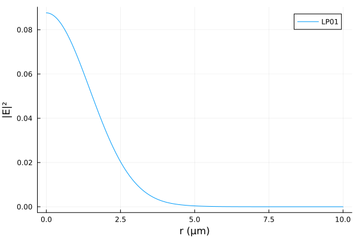

# OpticalFibers.jl

OpticalFibers.jl is a package that allows to compute modes of optical fibers. Different methods are implemented to find scalar or vector modes: 
- A semi-analytical solver (based on Bessel functions) for multi-step index fibers.
- Finite difference method for graded-index isotropic fibers.
- Finite element method (using `Gridap.jl`) for any kind of isotropic or anisotropic fiber (useful to find leaky modes using a PML for example)

## Installation
OpticalFibers.jl requires at least julia 1.9 and can be installed with:

```julia
using Pkg
Pkg.add("OpticalFibers")
```

## Quickstart
Computation of the scalar fundamental mode (l=0) of a step index fiber with a core-radius of 2 µm, a refractive index of 1.47 for core and 1.45 for cladding at a wavelength of 1 µm:
```julia
julia> using OpticalFibers
julia> using OpticalFibers.ModeSolvers
julia> ms=multi_step_fiber_modes(1,0,2,[1.47,1.45])
1-element Vector{ScalarMode1D}:
 ["LP 0,1",1.463179347605715,1.0,0]
```
Computation of the fundamental vector mode (l=1) of the same fiber:
```julia
julia> mv=multi_step_fiber_modes(1,1,2,[1.47,1.45],type=:Vector)
1-element Vector{VectorMode}:
 ["HE 1,1",1.4631371608572663,1.0]
```

Computation of the scalar modes of a parabolic-index fiber with a core-radius of 4 µm, a refractive index of 1.48 for core center and 1.45 for cladding at a wavelength of 1 µm by using the finite difference method with 1000 nodes between r=0 and r=20 µm:
```julia
julia> using OpticalFibers
julia> using OpticalFibers.ModeSolvers
julia> m=FD.(1,[0,1,2],5,r->1.45+0.03*(1-r^2/16)*(r<=4),1000,20,field=true)
3-element Vector{Vector{ScalarMode1D}}:
 [["LP 0,1",1.471980845215266,1.0,0,[0.0,20.0],[1.1164104145818255e-15,0.12423741722742176]], ["LP 0,2",1.456151117128024,1.0,0,[0.0,20.0],[-0.06350256918319086,0.14163056081827127]]]
 [["LP 1,1",1.4639612833431581,1.0,1,[0.0,20.0],[-0.10628423740430118,0.0]]]
 [["LP 2,1",1.4560227630144946,1.0,2,[0.0,20.0],[-0.10409704787976527,0.0]]]

julia> m[1][1]
Name = LP 0,1
neff = 1.471980845215266
lambda = 1.0
nu = 0
r ∈ [0.0,20.0]
E ∈ [-0.12423741722742185,-1.114629187729248e-15]

julia> using Plots
julia> plot(m[1][1].r,abs2(m[1][1].E))
```


## Credits
OpticalFibers.jl is maintained by Olivier Vanvincq ([university of Lille](https://www.univ-lille.fr/), [PhLAM laboratory](https://phlam.univ-lille.fr/)).

